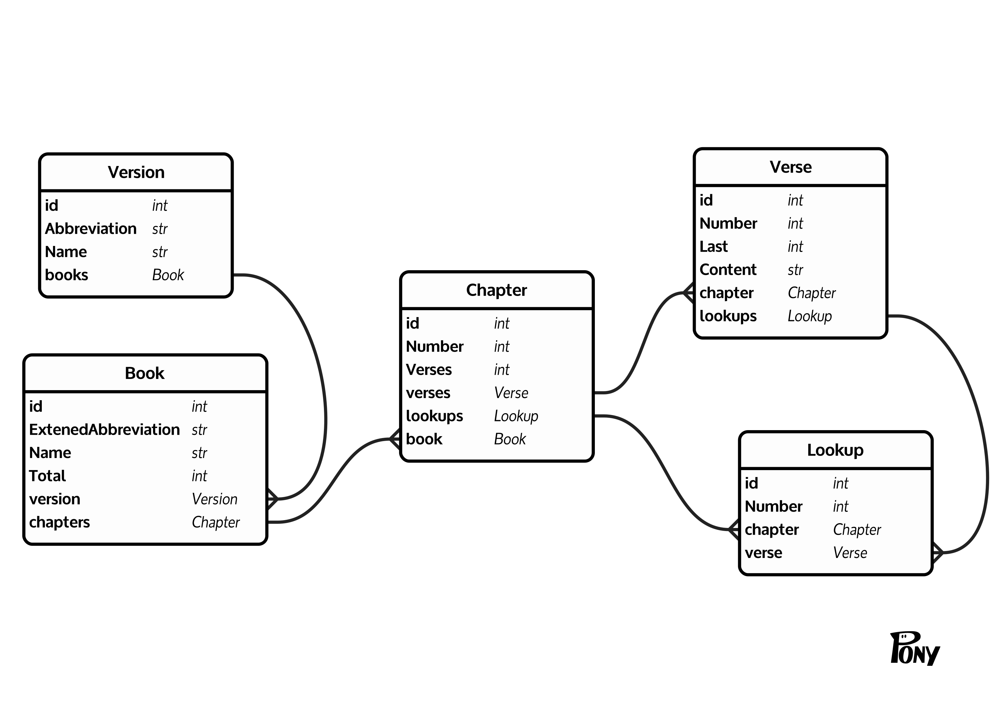

# Bible Store

We will need to have a way of storing and accessing the bible verses...

* Bibles with contain:
  * Versions:
    * Id
    * Abrieviation (key)
    * Name
    * Later these will need:
      * Completed flag
      * Copyright details including:
        * Timestamp to identify updated content
  * Books
    * Id
    * Extended abrieviation (key)
    * Name
    * NumberOfChapters (last chapter number)
    * Version.Id (foreign key)
    * And later the other stuff
  * Chapters
    * Id
    * Number (key)
    * NumberOfVerses (last verse number)
    * Book.Id (foreign key)
    * Version.Id - maybe (foreign key)
  * Verses
    * Id
    * Number (some versions have number range) (key)
    * Content (could be template or html format?)
    * Chapter.Id (foreign key)
    * Book.Id - maybe (foreign key)
    * Version.Id - maybe (foreign key)
  * VerseLookUps
    * Id
    * Number (for each number in 1..Chapter.NumberOfVerses) (key)
    * Verse.Id (usually 1 - 1 mapping, but could be many - 1 mapping)
    * Chapter.Id (foreign key)
    * Book.Id - maybe (foreign key)
    * Version.Id - maybe (foreign key)

Although the Bibles are accessed by version and book name and chapter number, 
we will assume that they will be consistent (copyright version) at least by book,
so once "complete" we can juts validate each known book has not changed copyright version,
but if it has we can refresh that.

## Reference look up

We can assume that references are of the format:

`<Book> " " <Chapter> [" "] ":" <Verses> ["," [" "] <Verses>]`

Where Book is:
`[<1, 2 or 3> " "] <Abreviation>`

And Abreviation is min first 3 letters of Book Name

Where Chapter is a positive integer

Where Verses are:
`<Verse> ["-" [" "] <Verse>]`

And when used for look up it is converted to series of:

`<Extended abreiviation> " " <Chapter> ":" <Verse> ["-" <Verse>]`

Where Extended abreiviation is:

`[<1, 2 or 3>] <3 letter abreviation>`

### Issue

There is a weakness here, as it is possible for two nearby (non-contiguous) references 
to overlap in some versions (e.g. MSG), but we wil have to live with it to best format 
contiguous verse in the best light (paragraphing and indentations)